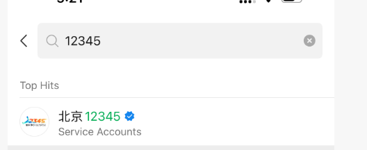
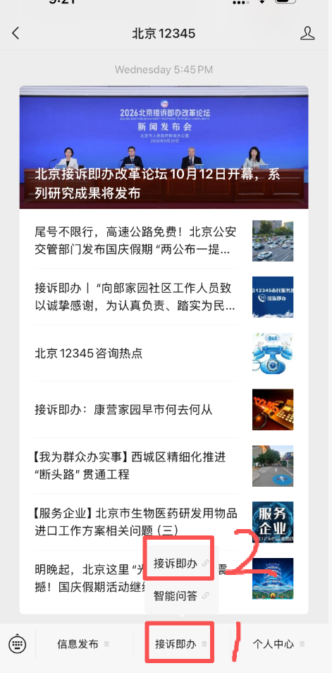
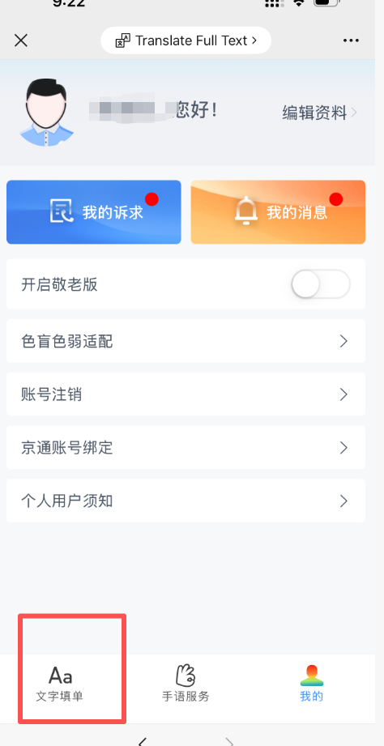
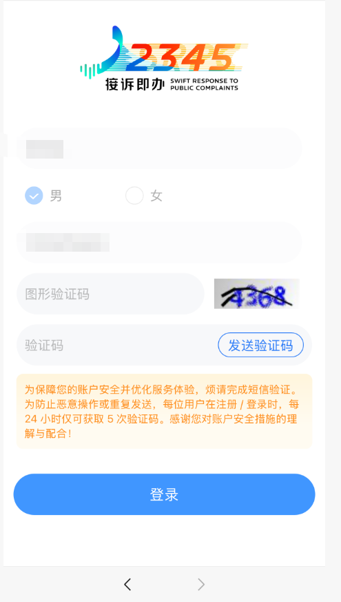
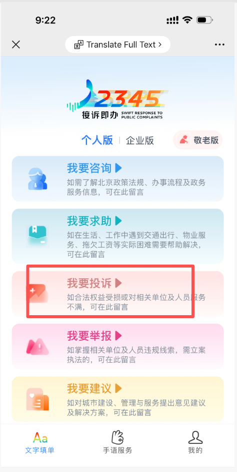
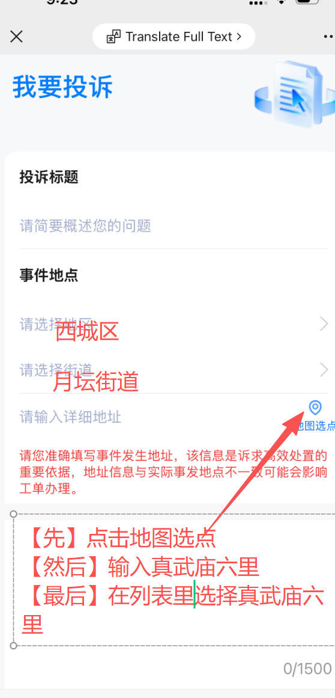
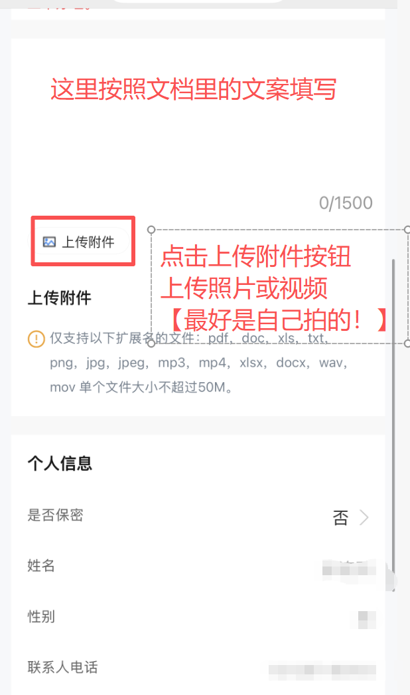

# 真武庙六里老旧改质量问题投诉维权操作指南

> **辖区信息**：北京市西城区月坛街道真武庙六里社区  
> **反映渠道**：北京市“12345”市民服务热线微信公众号（接诉即办） / 12345 电话热线  
> **主要监督部门**：北京市西城区住房和城市建设委员会、北京市西城区市场监督管理局、西城区消防救援支队、西城区纪检监察部门、西城区审计局、月坛街道办事处  
> **编制说明**：本文档包含 **12345 微信端图文投诉流程** 以及 **核心问题标准投诉/举报文案**，供全体维权业主复制、修改与电话照念使用。

---

## 📌 导读与 12345 核心规则说明

1. **全书分为两大部分**：
   - **第一部分**：**【12345 微信端图文投诉流程】**
   - **第二部分**：**【专项维权诉求文案】**（包含电梯、胶水、外墙保温层的专项投诉文案，可直接复制或电话照念）。
2. **12345 官方严格执行“一事一诉”规则**：
   - 12345 平台规定，每次反映仅受理单一事项。
   - 针对【电梯问题】、【胶水问题】、【保温层问题】，**请大家按照第一部分流程分别发起 3 次反映，生成 3 张独立工单**分别立案督办！
3. **【事项与填单类型】**：
   - **事项 1（电梯严重安全隐患）**：业务类型请点击选择【**我要投诉**】；
   - **事项 2（劣质刺鼻建筑胶粘剂）**：业务类型请点击选择【**我要投诉**】
   - **事项 3（外墙保温篡改工艺偷抹砂浆涉嫌套取财政资金）**：**业务类型务必点击选择【我要举报】**

---

## ☎️ 【打算打电话投诉的邻居：直通照念指引】

如果您习惯通过拨打 **12345 电话热线** 反映：
1. 请直接往下滑动到本文档 **【第二部分：三大老旧改专项诉求文案】**；
2. 接通 12345 话务员后，首先明确告知：“**我要反映西城区真武庙六里老旧改工程问题，共有 3 件独立违规事项，请严格按照一事一诉原则，帮我分别生成 3 张独立工单进行派发！**”；
3. 随后逐项照着文案中的 **【诉求标题】**、**【事实依据】** 与 **【诉求】** 朗读即可！
4. 但是， **文字填单可完整提交详尽法条、违规事实并上传自拍现场音视频，证据效力远超语音描述**，而且效率也比打电话，等着12345接线员记录要高。因此有能力的还请尽量根据以下流程，在微信端发起12345投诉。
---

# 第一部分：12345“接诉即办”线上文字投诉操作全流程

### 步骤 01：微信搜索并关注官方公众号“北京12345”

1. 打开手机微信，点击最上方的搜索栏。
2. 在搜索输入框中输入：`12345` 。
3. 在搜索结果的公众号列表中，认准带有 **蓝色官方认证对勾徽标** 的【**北京12345**】（服务号 Service Accounts）。
4. 点击进入公众号资料主页，点击【**关注公众号**】。

**必须认准官方认证蓝标“北京12345”（认证主体为“北京市市民热线服务中心”），切勿进错个人号或非政务公众号。**



---

### 步骤 02：进入公众号，点击进入底部“接诉即办”

1. 进入“北京12345”公众号的会话聊天界面。
2. 查看手机屏幕最底部的菜单栏，点击中间的【**接诉即办**】菜单（对应图2中红色数字 **1** 标注处）。
3. 在向上弹出的子菜单列表中，再次点击【**接诉即办**】（对应图2中红色数字 **2** 标注处）。
4. 系统将自动加载并跳转至北京市统一接诉即办服务专区。




---

### 步骤 03：进入平台首页，点击底部导航栏“文字填单”

1. 系统进入接诉即办移动端首页（如提示定位或用户信息授权，请点击允许）。
2. 观察手机屏幕最底部的横向导航栏（包含：文字填单、手语服务、我的）。
3. 点击最左侧带有“Aa”图标的【**文字填单**】按钮（对应图3红框标出位置）。
4. 进入工单填报与个人身份验证环节。




---

### 步骤 04：个人信息实名认证，短信验证登录

1. 进入实名登录界面，如实输入 **真实姓名** 并勾选 **性别**（男/女）。
2. 输入本人正在使用的 **实名手机号码**。
3. 照着右侧图片输入【**图形验证码**】。
4. 点击【**发送验证码**】，查收手机收到的短信验证码并准确填入。
5. 点击底部醒目的蓝色【**登录**】按钮。




---

### 步骤 05：进入诉求大厅，选择业务类型（投诉 vs 举报）

1. 登录成功后进入“文字填单”业务大厅，界面列有咨询、求助、投诉、举报、建议五个板块。
2. 点击【我要投诉】，或【我要举报】。
> **※ 保温层建议点【我要举报】**  
> 施工方擅自变更图纸、趁假期抢工涂抹沉重保温砂浆、涉嫌套取国家财政专项补贴，属于严重违纪违法违规行为，必须选择【我要举报】直接触发区住建委、区纪检监察部门的行政与执法立案程序！



---

### 步骤 06：填写标题与事件地点

1. **【投诉/举报标题】**：填入第二部分文案给出的举报标题。
2. **【请选择地区】**：下拉列表中精准选择【**西城区**】。
3. **【请选择街道】**：下拉列表中精准选择【**月坛街道**】。
4. **【请输入详细地址（严格按照图6红字三步走）】**：
   - **【第一步】**：点击地址输入框最右侧的蓝色 **“地图选点”定位图标**；
   - **【第二步】**：在弹出地图顶部的搜索栏中输入：`真武庙六里`；
   - **【第三步】**：在下拉匹配地址列表中，点击选择【**真武庙六里**】确认。




---

### 步骤 07：录入诉求内容、上传自拍佐证附件、设置保密并提交

1. **【填写诉求内容】**：直接复制本文档第二部分对应专项文案，粘贴进 1500 字正文框中。
2. **【上传附件（图示红框标注，极重要证据）】**：
   - 点击带有相框图标的【**上传附件**】按钮；
   - **强烈建议上传大家自己实地拍摄的照片或视频！【最好是自己拍的！】**
   - **重点佐证材料推荐**：
     - 电梯门洞与门框 3~5 厘米巨大缝隙特写照片；
     - 电梯外门关闭后徒手一扒即开的现场实拍短视频；
     - 门扇闭合后可塞入手指的超标门缝实拍；
     - 电梯运行中严重尖锐异响视频；
     - 现场刺鼻建筑胶水桶照片及工人在门缝抹胶近景；
     - 外墙涂抹砂浆现场拍照/录像、大风扬尘及外立面脱落隐患点。
   - 支持格式：`png, jpg, mp4, docx, pdf` 等，单个文件不超 50M。
3. **【个人信息与是否保密】**：
   - 选【**否**】：便于住建委、市监局、纪检及街道工作人员直接电话联系您，实名举报效力更强。

4. **【确认提交】**：核对姓名电话后点击【**提交**】，获得“12345...”唯一工单编号。

> **★ 牢记“一事一诉”规则 · 发起 3 次反映**：  
> ① 提交【电梯问题】：选“我要投诉” ➔ 生成第 1 张工单；  
> ② 提交【胶水问题】：选“我要投诉” ➔ 生成第 2 张工单；  
> ③ 提交【保温层问题】：选“我要举报” ➔ 生成第 3 张工单！



---

# 第二部分：三大老旧改专项诉求文案（一事一诉 · 独立立案）

---

## 【专项 1】新装电梯重大安全隐患、缩水欺诈及虚假验收专项投诉

- **业务分类**：在线填单请选择【**我要投诉**】；电话投诉请向话务员说明为“投诉电梯安全隐患”。
- **诉求标题**：
  > 举报真武庙六里小区新装电梯存在层门一扒就开、门洞缩水、用胶水封堵门缝、虚假验收及恶意停梯报复等问题

- **诉求正文（可直接全选复制 / 电话照着念）**：

```text
此单请派给西城区住建委、西城区市场监督管理局，谢谢。
我是真武庙六里小区的居民。本小区近期新更换的电梯虽声称已走完采购、安装、调试及验收流程，但实际交付的是一批尺寸不配套、违反多项国家强制标准、存在致命安全隐患的劣质工程。现就违法违规事实提出举报：

1. 门洞缩水与选型错误：新装电梯轿厢门口及每层层门门框，比楼道原有电梯门洞整整小了3至5厘米，根本压不住原有门口，导致每层门框两侧遗留巨大空隙，既不结实也不安全。根据《关于进一步做好住宅老旧电梯更新有关工作的通知》及《安装于现有建筑物中的新电梯制造与安装安全规范》，旧梯更新必须经现场严格勘测并定制匹配既有建筑门洞与井道的设备。施工方为压缩成本，无视原建筑结构尺寸，采购小尺码、不配套的设备硬塞进大门洞，属于严重的选型错误与履约欺诈！电梯关系全体居民未来十几年生命安全，绝不是靠修修补补就能凑合的，必须拆除退回，按原门洞标准尺寸重新采购配套电梯并彻底返工！

2. 违规用胶与消防剧毒浓烟隐患：由于门框比门洞小3至5厘米，施工方直接用胶水找齐封堵。根据《建筑防火通用规范》及《电梯工程施工质量验收规范》，乘人电梯应确保不低于2.00小时耐火极限。用有机胶体填充宽达3–5厘米的结构缝隙，一旦发生火灾，胶体燃烧将产生剧毒浓烟并通过电梯井瞬间灌满全楼。

3. 致命机械缺陷与虚假验收渎职：新电梯外门在关闭状态下用手一扒即开，且门扇之间及门扇与门套间隙肉眼可见，能塞进一只手指，严重违反《电梯监督检验和定期检验规则》，随时可能引发人员坠井伤亡。并且运行时有巨大异响（有视频为证），如此直观的违法缺陷竟能通过验收，特检院检验人员与工程监理严重涉嫌走过场及渎职造假。

4. 恶意停梯打压维权业主：在业主提出上述质疑后，物业与电梯方竟宣布将三部电梯在白天同时停运两天。一组人员同一时间只能检修一台梯，且门框小3-5厘米的土建缺陷根本无法靠停梯两天解决！其真实目的是故意制造全楼出行瘫痪，激化居民内部矛盾，逼迫维权业主妥协，随后走过场宣布“没问题”蒙混过关。

诉求：
1. 由于错误尺寸的电梯和胶水封堵带来的安全隐患难以依靠小修小补解决，要求产权单位（老旧改工程的甲方）和住建委责令施工单位彻底返工，绝不接受在错误尺寸和毒胶封堵上小修小补！必须拆除不配套的缩水电梯，严格按照原门洞与井道标准尺寸重新采购配套电梯、用混凝土规范浇筑封堵门洞并彻底返工，由此造成的返工成本及延误使用责任由施工及相关责任方承担！
2. 派执法人员在业主代表见证下，现场实测层门扒门抗力、门锁啮合深度、门缝间隙及运行噪声；倒查该电梯《电梯监督检验报告》是谁签字放行的，依规调取电梯检验时，进行安全实验的影像记录。
3. 公开全部与电梯相关的所有产品及服务项目的采购与验收账目。
4. 对于为什么采购尺寸小于原始门洞的电梯，为什么用胶水门框与门洞的缝隙，为什么外门一扒就开，为什么关了门有那么大的缝，为什么这么多问题也能通过检测。请出具书面解释，由负责领导亲笔签字、加盖公章。
```

---

## 【专项 2】违规使用刺鼻劣质建筑胶粘剂、拒不提供环保检测报告专项投诉

- **业务分类**：在线填单请选择【**我要投诉**】；电话投诉请向话务员说明为“投诉施工材料环保违规”。
- **诉求标题**：
  > 举报真武庙六里小区老旧改工程违规使用刺鼻劣质胶粘剂、拒不提供有毒有害物质检测报告

- **诉求正文（可直接全选复制 / 电话照着念）**：

```text
此工单希望转派给西城区住建委及西城区市场监督管理局。
我是真武庙六里小区的居民。目前本小区正在进行老旧改。施工单位在现场大量使用具有强烈刺鼻气味的建筑胶粘剂，严重危害居民身体健康。 

1. 违反国家强制环保标准：根据国家强制性标准《胶粘剂挥发性有机化合物限量》及《民用建筑工程室内环境污染控制标准》，工程使用的胶粘剂必须具备苯、甲苯、二甲苯、游离甲醛及TVOC合格检测报告，并经监理核验合格后方可使用。

2. 拒不出示环保报告，涉嫌以次充好套取资金：居民多次要求施工方及监理单位出示该批次胶粘剂的有毒有害物质检测报告，但施工方一直拒不提供，仅拿出一份与环保安全毫不相干的“物理强度检测报告”蓄意敷衍欺骗居民，在居民多次提出质疑后，未给出进一步答复。这种欲盖弥彰、蓄意逃避质量溯源的反常举动，无法使用工作疏忽来解释，居民有充分理由怀疑其中存在以廉价劣质胶水充抵合规环保建材、偷工减料套取老旧改财政专项资金等深层违规问题，亟待监管部门彻查。

诉求：
1. 立即责令施工方暂停使用该批次不明刺鼻胶水，现场核查该胶水的《工程物资进场报验表》、监理签字记录及环保检测报告；若无合格环保报告，依法追究施工方偷工减料及监理单位违规放行的责任。
2. 要求区市监局到施工现场对该批次胶粘剂成品进行封存，并在居民代表见证下进行有毒有害物质抽样送检。
3. 要求向投诉人书面反馈核查结果，并向全体居民公示符合国家强制标准的环保检测报告原件。
```

---

## 【专项 3】擅自篡改外保温工艺、违规涂抹“保温砂浆”及涉嫌套取财政资金专项举报

> **⚠️ 特别声明**：  
> 通过 12345 公众号办理此事项时，**请务必点击【我要举报】，而不是【我要投诉】！**  

**举报标题**
  > 举报真武庙六里老旧改施工方修改原定外保温工艺、未经审批趁假期突击施工，借设计变更套取财政资金的违法行为！
- **举报正文（可直接全选复制 / 电话照着念）**：

```text
请将此工单派给住建委、产权单位、纪检监察部门！
我是真武庙六里小区居民。本小区老旧改工程原招标及设计方案明确为在楼体外立面铺贴外墙保温板砖。但施工单位为压缩成本、应付验收，竟编造谎言、设计连环套，趁假期擅自改为在楼体外墙涂抹厚重劣质的“保温砂浆”。现就其流程违法、擅自改设计、严重威胁公共安全及涉嫌套取财政资金举报如下：

1. 谎称墙薄违反物理学与工程学常识，改抹沉重劣质砂浆，隐患致命：施工方谎称“原墙体/阳台太薄、承重不行，禁不住保温板”，以此否定原设计方案。然而，常规外墙保温板密度仅约 20千克/立方米，而保温砂浆干密度高达300千克/立方米以上，保温砂浆比保温板重数倍，而保暖隔热性能却远不及保温板！所谓“因为墙薄不承重，所以改抹更沉重的砂浆”在物理学和工程学上根本站不住脚！其真实目的是保温砂浆成本低、省工省料！本楼此前已多次发生外立面墙皮脱落事件，曾险些砸伤居民（有历史记录可查）。鉴于老旧改工程施工现场发现各种各样的违规作业问题（有居民群聊天记录为证），居民对当前施工质量毫无信任，担心涂抹沉重的保温砂浆，维保期一过就会出现空鼓坠落，直接威胁全楼居民生命安全！

2. 连环套暗箱操作，推卸降标责任，趁假期突击抢工涂抹上墙：施工方与相关方在变更流程中大搞暗箱操作，他们先将外保温方案变更为内保温，在明知已入住居民绝不可能同意破坏室内装修做内保温的前提下，企图故意诱使居民反对后，再顺势二次变更为廉价的外墙保温砂浆，将降标责任推卸给业主。在阴谋未能得逞后，竟趁假期直接进场把保温砂浆抹上了墙！物业公司对此违规抢工行为视而不见、未予制止。

3. 高标招标低标实施，涉嫌串通恶意设计变更套取财政专项资金：本项目以高标准的“外墙保温板”工艺招标立项，最终却变成廉价的抹砂浆。中间巨大的材料与人工差价去向不明，高度涉嫌参建各方串通进行恶性设计变更、侵吞老旧改国家补贴资金，涉及施工单位中建一局等。

诉求：
1. 立即下达《停工通知书》，叫停现场涂抹保温砂浆的野蛮抢工行为！鉴于本楼多次发生墙皮脱落，坚决不同意在外立面保留沉重易掉的保温砂浆，要求将其彻底铲除或恢复安全合规工艺！

2. 要求施工、设计及监理单位领导出具亲笔签字并盖章的书面解释：
   ① 否定原保温板方案依据的是哪条国家强制标准？本楼外立面实测数据是多少，为何不达标？而丰台等同类薄阳台老旧小区为何能正常贴保温板？
   ② 为什么“承重不够”反而要改成重量大几倍、且已被淘汰的保温砂浆？
   ③ 公示本次施工单位，即中建一局，承接的其他北京市老旧改工程中，在哪些小区用了保温板、哪些用了保温砂浆的对比清单；
   ④ 要求区住建委彻查“未批先建”与“违规变更”，核查两次变更是否经过原图审机构重新审查，为何在未完成业主入户调查的情况下擅自施工？依法对施工、设计、监理单位予以行政处罚；
   ⑤ 要求区审计局及纪检监察部门介入资金审计：核查原招标“保温板”与实际“保温砂浆”的造价差额，严查是否存在借设计变更套取财政资金的违法犯罪行为！
```

---

# 第三部分：工单提交后跟进要点与官方回访应对话术

### 🔍 1. 实时跟踪 3 张工单流转与签收状态
- 提交工单后，在“北京12345”微信公众号底部点击【**接诉即办**】➔【**我的**】➔【**我的诉求**】。
- 随时查看电梯工单、胶水工单、保温层工单分别被派发至哪个单位（“月坛街道办”、“西城区住建委”、“西城区市场监管局”或“区纪委监委”）。
- 掌握各部门法定的签收与办理时限，防止超时未办。

### 📞 2. 官方电话回访应对统一口径与话术
- 提交后 24~48 小时内，月坛街道办、住建委或市监局工作人员会致电回访。
- 接听电话时请保持理性坚定，统一口径：  
  > “**我们反映的是全楼公用特种设备致命隐患与重大违纪违法行为，绝不接受在门洞上抹胶补缝、外墙偷抹砂浆等糊弄方案！我们坚决要求彻底拆除返工、现场封存抽检胶水、彻查保温层偷工减料与资金流向！**”

### 👥 3. 坚决要求“四方现场联合勘验”
- 若承办部门声称“施工方称合格”企图结案，请当场明确反驳并要求：  
  > “**必须安排区住建委质监站、特检院专家、消防支队、街道办以及业主代表共同到现场联合实测与开会勘验！绝不接受承办部门仅听信中建一局及施工方一面之词就草草销单结案！**”

### ⭐ 4. 结案满意度评价是终极制约武器
- 只要电梯没有彻底拆除返工、胶水没有出具合格报告、保温层砂浆未依法停工查处，当 12345 发来满意度评价短信或电话回访时，**坚决选择“不满意”**！
- 北京市接诉即办对“不满意”件实行 **强制二次督办考核** 并严肃扣分。这是倒逼职能部门动真格、逼迫责任方真正整改的最关键筹码！

### 📢 5. 倡议：一人三单，汇聚声量
- 请邻居们将本文档转发至各单元楼栋微信群。
- 每位邻居提交 3 张独立工单。
- **我们多一个人提交，施工方就少一分蒙混过关的侥幸！**

---

> **真武庙六里老旧改业主维权行动组 编制**  
> 共同守护家园安全 · 坚持依法依规维权 · 彻查严处违法违规
